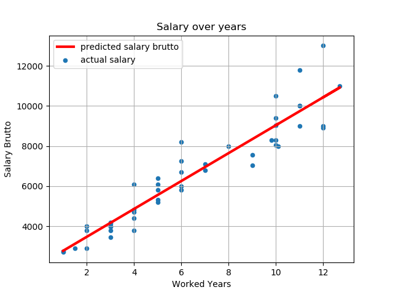

# Description:
1. Testing task from intive, for patronage 2019 Machine Learning & Big Data
    * zadanie1_cognitive.py, salary.csv
2. Python script are taking .csv file, filter it from missing data and estimate salary, on colums 'workedYears' and 'salaryBrutto', and plot it on diagram.

# Requirments:
* python 3.x
* pip

# Instalation:
1. Library instalation via. pip: pip install name_of_library
    * ex: pip install pandas

# Usage:
Input:
    filtred_data.plot(
                    kind='scatter',
                    x='workedYears', y='salaryBrutto',
                    label='actual salary')
    plt.plot(
        worked_years, salary_pred, c='red',
        linewidth=3, label='predicted salary brutto')
    plt.grid(True)
    plt.legend()
    plt.title('Salary over years')
    plt.xlabel('Worked Years')
    plt.ylabel('Salary Brutto')
    plt.show()

Predicted Output:

